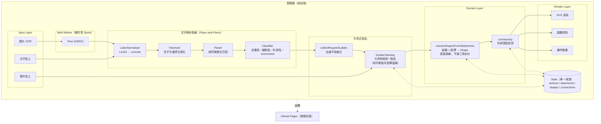
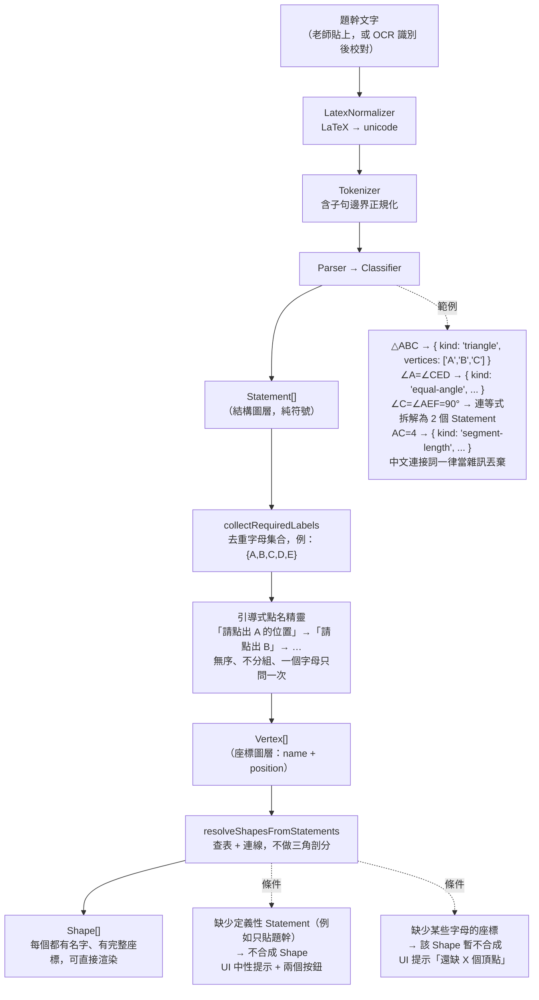
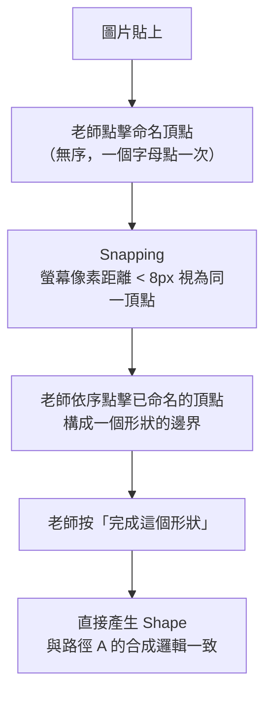
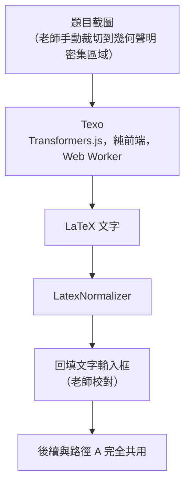
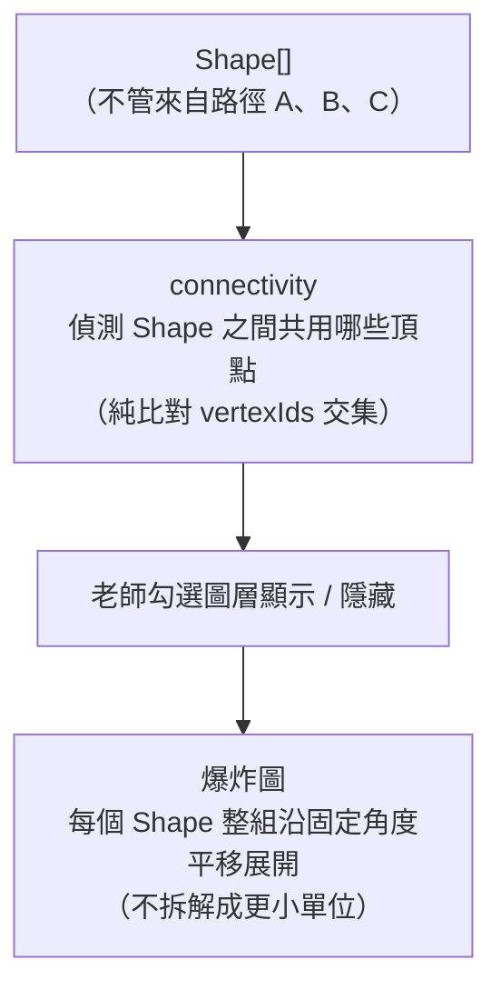

# 幾何圖形教學工具：框架圖與 Agile 開發流程

**版本：** MVP 定稿 v8（結構／座標雙圖層模型 + 整合外部審查意見）
**授權：** GPL-3.0
**部署：** GitHub Pages（純前端、零後端）
**目標：** 讓 K-12 老師用最輕量的方式，把重疊幾何圖拆解成可教學的結構

一句話：老師貼上一張幾何題目截圖，貼上題幹文字（或用 OCR 識別），系統解析出文字裡宣告的三角形／四邊形等結構；老師只需要依系統提示，把每個提到的字母在圖上點一下標出位置，系統就能直接把文字宣告的形狀「畫」出來，再讓老師勾選圖層、按爆炸圖拆開展示。（「點在線段上」這類關係不需要文字解析——見 0.8 節）

技術本質：純前端 + 輕量文字解析（非通用 NLP）+ 兩圖層合成（結構圖層 × 座標圖層）
複雜度：文字解析為固定樣式的 O(n) tokenizer/parser；結構合成為 O(k)，k = Statement 數量；連通偵測為 O(k²)（k 通常 < 10）。**不涉及三角剖分、不涉及窮舉、不涉及組合搜尋。**
風險：核心風險集中在文字解析對真實語料的覆蓋率，可在 Sprint 0 用真實掃描檔驗證清楚

---

## 〇、核心模型是怎麼收斂出來的

這個專案的架構經過幾輪推翻重來，最後收斂到一個比最初「手動點頂點 → 系統自動三角剖分」簡單得多、但也更準確反映真實使用情境的模型。以下記錄推導過程，因為每一步的「為什麼不這樣做」跟結論本身一樣重要。

### 0.1 最初的假設：系統自動切三角形（已推翻）

最早的版本是「老師點頂點 → 系統用 Ear Clipping 自動三角剖分 → 老師勾選圖層合併」。這個假設有兩個問題：

1. **只適用於一種拓樸。** 真實語料裡（見 0.4）大量出現的是「兩條線交叉於一點」（蝴蝶結型），這種輸入根本不是一個簡單多邊形，Ear Clipping 這個工具用不上。
2. **切割是無語義的，會產生老師不需要的原子區塊。** 即使勉強切了，切出來的三角形本身不知道「哪幾塊合起來是老師要教的那個形狀」，還需要一層額外的合併邏輯去猜。

### 0.2 中間的假設：窮舉切割 + 文字窄化（已推翻）

下一版想法是：先把整張圖窮舉切成最小單位的原子面（用平面直線圖 PSLG 的方式處理任意交叉線段），再用文字宣告去搜尋「哪些原子面的聯集等於文字提到的形狀」。

這個想法在邏輯上可行，但**做了不必要的事**：如果文字已經明確宣告「△ABC」，系統要做的其實只是「把 A、B、C 三個點連起來」，不需要繞道先切出一堆原子面再逆向搜尋哪些面拼得出這個三角形。窮舉再窄化，是在解一個比實際問題更難的問題。

### 0.3 最終模型：結構圖層 × 座標圖層，直接合成

**關鍵洞察：形狀的「結構」（哪些點構成哪個形狀、依什麼順序連線）幾乎全部都已經寫在題幹文字裡了；系統唯一缺的是「這些字母對應到截圖上的哪個實際位置」。**

這兩件事是完全獨立的兩個圖層：

| 圖層 | 提供什麼 | 來源 | 特性 |
|---|---|---|---|
| **結構圖層** | 哪些字母構成一個形狀、依什麼順序連線、字母之間的語義關係（角相等、長度……） | 題幹文字解析（貼上文字或 OCR） | 純符號，無座標 |
| **座標圖層** | 每個字母對應截圖上的實際位置 | 老師點擊命名 | 純位置，無結構 |

兩層合成的方式很直接：拿到「△ABC」這句宣告後，去查 A、B、C 各自的座標（老師點擊命名過的），然後直接把三個點連起來畫出三角形——**不需要三角剖分，不需要窮舉，不需要搜尋**。

這個模型直接解決了老師操作繁瑣的問題：**老師不需要按順序點、不需要分組、不需要按確認鍵去標記「這幾個點屬於同一個形狀」**——順序與分組這些結構資訊，全部由文字宣告提供；老師只要「點一下、標個名字」，一個字母只做一次，做完就結束。

### 0.4 真實語料驗證（依實際掃描的講義題目）

用一份相似三角形單元的講義驗證了這個模型，歸納出四種在真實教材裡出現的情境：

**類型一：蝴蝶結型（shared-vertex crossing）**
例：`C-A-E` 一條直線、`B-A-D` 一條直線，交於 A，形成 △ABC、△ADE 共用頂點 A。
文字：「△ABC和△ADE」→ 直接連 A-B-C 一個三角形、A-D-E 另一個三角形。兩個三角形都是文字**直接**給的，不需要知道老師點擊順序。

**類型二：巢狀型（nested，point-on-segment）**
例：E、F 分別在 AB、AC 上，△AEF 疊在 △ACB 裡面，講義原文甚至直接畫了「拆解→」的手繪箭頭，把兩個三角形拆開展示——這正是這個工具想自動化的動作。
文字：「△ACB與△AEF」→ 一樣是兩個被文字直接命名的三角形，各自照宣告順序連線即可，不需要把大三角形「切開」才能拿到小三角形，因為小三角形的三個頂點（A、E、F）本身就已經是被點過名的座標。**「E 在 AB 上」這件事本身不需要被文字解析出來，也不需要系統驗證——見 0.8、6.13 節。**

**類型三：角相等衍生的相似（equal-angle）**
例：`∠A=∠CED`、`∠B=∠E，∠C=∠F`。這種「角等於角」的宣告，在原本的資料模型裡沒有對應的 Statement 類型（原本只有「角等於一個數值」），這次驗證後補上 `equal-angle`。

**類型四：只有約束條件，形狀名稱藏在子題裡**
例（講義第 4 題）：題幹只有 `AB // DE，AC=4，CD=3`，但子題 (1) 問「△ACB 與 △DCE 是否相似？」——三角形名稱藏在問句裡。
- **貼整題**（含子題）→ 三角形名稱抓得到，正常處理
- **只貼題幹**（不含子題）→ 沒有任何形狀宣告，系統明確引導老師補貼子題或改用手動連線

**額外驗證：三角形識別不依賴上下文語意**
講義裡很多是「△ABC和△ADE是否相似？」這種問句形式，甚至有「(1) △CAB~△___」這種填空題型（講義第 1 頁第 1 題）。這對核心構造沒有影響——Parser 是用「位置掃描」找 `△XYZ` 這個樣式，不管前後文是不是問句、句子裡有沒有中文字、後面接不接得上空格或底線，一樣抓得到三角形宣告。**這個工具不判斷、也不記錄「是否相似」這件事本身（scope 明確排除，見 0.7、0.8 節）——「△CAB~△___」這句話對系統來說唯一有意義的產出，就是「△CAB」這一個三角形宣告。**

### 0.5 沒有文字時的退路

沒有題幹文字（也沒有截圖可 OCR）時，結構這一層要從哪裡來？答案是：**老師手動指定連線順序，走同一套下游邏輯，只是「Statement 從哪來」不同。** 老師依序點擊已經命名好的幾個頂點（例如點 A → 點 B → 點 C），按下「完成這個形狀」，系統直接產生一個等同於文字宣告出來的 Shape。文字路徑與手動路徑最終匯流到同一個資料結構與同一套渲染/連通/爆炸邏輯，差別只在「順序資訊從文字來，還是從點擊順序來」。

### 0.6 手動連線是首選路徑之一，不是後備

某些題型下（例如第 4 題），手動連線反而比貼整題更快：

- **貼整題**：文字量大，Parser 要處理的噪音多，還要抓子題裡的形狀名稱
- **手動連線**：只要點 6 下（3+3），完全不會被中文字干擾

這說明手動連線不是「後備路徑」，而是「某些題型下的首選路徑」。Sprint 1 的 `ManualLinkControl.tsx` 值得投入足夠的設計時間。

### 0.7 MVP 明確不處理的範圍

- **截圖裡沒被文字命名、也沒被老師手動框出的剩餘區域**：不處理。這個工具的目的是把老師在教學時「會特別拿出來講」的那幾個形狀拆解展示，不是把整張圖窮盡分割成互斥區塊。
- **形狀之間的部分重疊但未被命名的區域**（例如兩個命名三角形之外，圖上還畫了别的線）：不特別處理，維持原圖背景顯示即可。
- **從線段關係反推該連成什麼形狀**：不做。如果系統開始從 `AB//DE` 猜「A、B、C 應該連成一個三角形」，就會退回之前推翻掉的「窮舉/猜測」模型。
- **判斷或記錄「兩個形狀是否相似」**：不做。相似與否是老師上課要問學生的教學問題，不是系統要計算或儲存的資訊。系統只負責解析結構（形狀由哪些點構成、怎麼連線）、標點、畫形狀、拆解展示——不涉及任何幾何性質的判定或證明。
- **驗證「點在線段上」是否成立**：不做（MVP）。老師點擊的座標直接視為正確，系統不做共線檢查——見 0.8、6.13 節。

### 0.8 範圍再收斂：拿掉 `similar`，拿掉 `point-on-segment`（第二輪語料驗證後）

對照一份真實掃描講義逐題檢查後，發現資料模型裡有兩個地方「多做了」不必要的事，值得記錄推翻的理由：

**拿掉 `similar`：** 這個專案的 scope 從頭到尾只處理「結構」——形狀由哪些點構成、依什麼順序連線——不處理「兩個形狀是否相似」這種教學判斷（見 0.7）。而且 0.4 節已經驗證過，Parser 抓三角形宣告本來就不靠上下文語意，問句、填空都抓得到。也就是說，`similar` 這個型別從一開始就沒有任何下游邏輯在消費它——`resolveShapesFromStatements` 不需要它來畫形狀，`connectivity` 不需要它來判斷共用頂點，爆炸圖也不需要它來決定方向。留著它只是徒增一個沒有下游消費者的資料型別，予以移除。

**拿掉 `point-on-segment`：** 這是本輪最值得記錄的推翻，而且經過外部審查後又往前修正了一步。

原本以為「E、F 分別在 AB、AC 上」這句話需要 Parser 解析出一個獨立的關係型別，但實際檢查下游邏輯後發現完全不需要：`resolveShapesFromStatements` 畫 △AEF 只需要 definitions 裡的「△AEF」三角形宣告加上 A、E、F 三點的座標，不需要另外知道「E 在哪條線段上」；`connectivity` 純粹比對兩個 Shape 的 `vertexIds` 交集，同樣用不到這個資訊。

真正的原因是：**E 在 AB 上這件事，在老師把 E 點在照片上的那一刻就已經被座標圖層自動保證了，不需要文字圖層再講一次。** 這正是本專案「物理結構優先」的精神（見 0.5、0.6）——凡是點擊座標就能天然滿足的幾何事實，文字解析不需要重複確認。

第一版的處理方式是「保留 `point-on-segment` 型別，只是移出 Parser 的必要解析範圍，留給未來的約束驗證用」。但這個做法本身有問題：**如果 Sprint 0～3 完全沒有任何任務會去產生或消費這個型別，它就是一個沒有測試覆蓋、沒有實作路徑的殭屍型別**——留著它比乾脆不留更容易誤導未來接手的人，讓人以為這是已經在跑的功能。按 YAGNI 原則，**現在直接把這個型別從資料模型整個移除**；§6.7 想做的「約束驗證」功能如果未來真的要做，屆時再重新定義這個型別即可，成本很低（加一個 union member），不需要現在就先占位。

移除這兩者後，Parser 的必要覆蓋範圍收斂成純符號樣式（△／四邊形宣告、線段長度、角度值、平行、垂直、等角、等長），**不再需要理解任何中文語法結構**——這也讓最初選用 texify2（LaTeX 導向的 OCR）的判斷完全站得住：在這個收斂後的範圍裡，中文確實只是可以整段丟棄的分隔雜訊，不需要保留任何語意關鍵詞白名單，OCR 路徑與貼文字路徑在 Parser 覆蓋範圍上完全對等，不再有例外。

---

## 一、專案定位

讓 K-12 老師不需要任何設計或程式背景，就能把課本上常見的「重疊幾何圖」
（例如 △ABC 和 △ADE 交於一點、E、F 分別在 AB、AC 上衍生出的巢狀三角形）拆解成一步步可教學的結構：
系統依文字宣告直接構造出每個被命名的形狀，標出形狀之間共用哪些頂點，
老師勾選圖層、決定顯示順序，按爆炸圖拆開展示給學生看。

系統不判斷、也不記錄任何幾何性質（例如是否相似、是否全等），也不驗證「點在線段上」是否精確成立——這些是老師教學時要處理的問題，不是這個工具的職責。

整個工具純前端運作，沒有後端、沒有資料庫，部署在 GitHub Pages 上即可使用，
任何學校網路環境都能直接打開瀏覽器操作。

---

## 二、框架圖

### 2.1 整體架構

### 2.1 整體架構



**關鍵設計決策：**

1. **結構圖層與座標圖層完全獨立，直到 `resolveShapesFromStatements` 才合成。** Parser 產出的 `Statement[]` 全程不知道任何座標；`Vertex[]` 全程不知道任何結構。這個分離讓兩邊都可以獨立測試。

2. **沒有「三角剖分」這個核心步驟。** 每個被文字命名的形狀，要嘛是三角形（三點必然可直接連成，不會自交），要嘛是文字給出明確頂點順序的多邊形（SVG 的 `<polygon>` 原生支援凹多邊形，不需要預先剖分）。

3. **手動路徑與文字路徑匯流於同一個 `resolveShapesFromStatements`。** 沒有文字時，老師手動依序點擊產生的「順序」本質上就是一個手動輸入的 Statement，走完全相同的下游邏輯。

4. **文字圖層只負責「光靠座標點不出來的資訊」。** 分組與連線順序（哪些字母構成哪個形狀）必須來自文字；「點在線段上」這種光靠座標就自然成立的事實，不需要文字圖層重複確認，系統也不驗證（見 0.8、6.13）。

5. **座標的正確性完全信任老師的點擊，不做幾何一致性檢查。** 即使老師點的 E 沒有精確落在 AB 線段上，渲染、連通偵測、爆炸圖都不受影響——這些邏輯只依賴「字母的身分（identity）」，不依賴「幾何位置是否共線」（見 6.13）。

### 2.2 資料流

#### 路徑 A：文字輔助（有題幹文字時，主要路徑）



#### 路徑 B：純手動（沒有題幹文字時的退路，也是某些題型的首選）



#### 路徑 C：圖片 OCR（文字路徑的前置處理器）



#### 匯流點：連通偵測 + 展示



### 2.3 資料模型

```typescript
// ── 座標圖層 ──────────────────────────────────────

type Vertex = {
  id: string;
  name: string;            // "A", "B", "C" —— 文字模式必填，是合成的查找鍵
  position: { x: number; y: number };  // 圖片座標系（image space）
};

// ── 角的表示法：支援單字母角（頂點已知、邊未知）與三字母角（完全確定）──
// 兩種形式不能被正規化成同一種內部表示，必須各自保留（見 6.9.2）

type AngleRef = {
  vertex: string;             // 角的頂點，例如 "C"、"E"
  rays?: [string, string];    // 兩條邊分別指向的字母，例如 ['A','F']；
                               // 若為單字母角（例如 "∠C"），此欄位為 undefined
};

// ── 結構圖層：純符號，無座標 ────────────────────────

type Statement =
  // 定義性（直接構造 Shape 的依據）
  | { kind: 'triangle'; id: string; vertices: [string, string, string]; source: string }
  | { kind: 'quadrilateral'; id: string; vertices: string[]; source: string }
  // 輔助性（不直接構造 Shape，僅供選配的約束顯示使用）
  | { kind: 'segment'; id: string; endpoints: [string, string]; source: string }
  // 約束性（供教學顯示用，不驅動任何座標）
  | { kind: 'angle-value'; id: string; angle: AngleRef; value: number; unit: 'deg'; source: string }
  | { kind: 'segment-length'; id: string; segment: [string, string]; value: number; source: string }
  | { kind: 'equal-angle'; id: string; angles: [AngleRef, AngleRef]; source: string }
  | { kind: 'equal-length'; id: string; segments: [[string, string], [string, string]]; source: string }
  | { kind: 'parallel'; id: string; segments: [[string, string], [string, string]]; source: string }
  | { kind: 'perpendicular'; id: string; segments: [[string, string], [string, string]]; source: string };

// 注意：
// 1. 沒有 `similar` kind。相似性判斷不在這個工具的 scope 內（見 0.7、0.8）。
//    「△CAB~△___」這種問句/填空句式，Parser 只會從中抓出「△CAB」一個 triangle 宣告，
//    「~△___」的部分因為抓不到完整字母組合，自然被忽略，不需要任何特殊處理。
// 2. 沒有 `point-on-segment` kind。這個型別在第一版曾經保留、後因 YAGNI 原則移除
//    （見 0.8）——MVP 完全不驗證「點在線段上」是否成立，也不需要相關資料結構。
//    §6.7 的約束驗證若未來真的要做，屆時再重新定義即可。

type ClassifiedStatements = {
  definitions: Statement[];   // triangle / quadrilateral —— 直接構造 Shape
  auxiliary: Statement[];     // segment —— MVP 中通常為空，僅供選配的約束顯示
  constraints: Statement[];   // 角度、長度、等長、平行、垂直 —— 純顯示用
  unresolved: string[];       // 解析不出來的片段，UI 明確列出
};

// ── 合成結果：Shape 直接由 Statement + Vertex 構造 ──────

type Shape = {
  id: string;
  name: string;             // "△ABC"、"四邊形ABCD"
  vertexIds: string[];      // 依 Statement 宣告順序，對應到 Vertex.id
  visible: boolean;
  source: 'text' | 'manual';
};

// ── 連通關係：Shape 之間共用哪些頂點（純比對 vertexIds 交集）──

type Connection = {
  shapeA: string;
  shapeB: string;
  sharedVertexIds: string[]; // 1 個 = 蝴蝶結型共用頂點；2 個以上 = 共用邊/多點
};

// ── OCR（選配路徑）─────────────────────────────────

type OCRStatus = 'idle' | 'loading-model' | 'recognizing' | 'done' | 'error';

type OCRResult = {
  status: OCRStatus;
  latex: string;
  confidence?: number;
  error?: string;
  modelProgress?: number;
};

// ── 整個場景 ──────────────────────────────────────

type Scene = {
  image: HTMLImageElement | null;
  text: string;
  classifiedStatements: ClassifiedStatements | null;
  ocrResult: OCRResult | null;
  vertices: Vertex[];
  shapes: Shape[];
  connections: Connection[];
  mode: 'idle' | 'guided-naming' | 'manual-naming' | 'manual-linking' | 'exploding';
  namingQueue: string[];      // 引導式點名的剩餘字母
  currentManualShape: string[]; // 手動連線模式下，目前正在組的頂點序列
};
```

### 2.4 目錄結構

```
geometry-teaching-tool/
├── package.json
├── tsconfig.json
├── vite.config.ts
├── LICENSE                        # GPL-3.0
├── README.md
├── NOTES.md
│
├── public/
│   └── favicon.svg
│
└── src/
    ├── main.tsx
    ├── App.tsx
    │
    ├── domain/                    # 純函數，無 DOM、無 React
    │   ├── parser/
    │   │   ├── types.ts
    │   │   ├── latexNormalizer.ts # LaTeX → unicode
    │   │   ├── tokenizer.ts       # 含 ∼、= 等符號 + 子句邊界正規化（，。；、換行）
    │   │   ├── parser.ts          # 含 triangle/quad/equal-angle/segment-length/連等式拆解/單三字母角
    │   │   └── classifier.ts      # 定義性 / 輔助性 / 約束性 / unresolved
    │   │
    │   ├── semantic/
    │   │   ├── collectRequiredLabels.ts
    │   │   └── resolveShapesFromStatements.ts   # 核心合成邏輯
    │   │
    │   ├── interaction/           # 手動路徑的互動邏輯
    │   │   ├── snapVertex.ts      # 螢幕像素 epsilon 換算
    │   │   └── screen.ts          # 螢幕像素 ↔ 圖片座標換算
    │   │
    │   └── graph/
    │       └── connectivity.ts    # Shape 之間共用頂點偵測
    │
    ├── services/
    │   └── ocr/
    │       ├── TexoWorker.ts
    │       └── texoClient.ts
    │
    ├── store/
    │   └── useSceneStore.ts
    │
    ├── features/
    │   ├── canvas/
    │   │   ├── Canvas.tsx
    │   │   ├── ImageLayer.tsx
    │   │   ├── VertexLayer.tsx    # 紅點 + 拖曳 + snapping
    │   │   └── ShapeLayer.tsx     # 直接渲染 Shape
    │   │
    │   ├── controls/
    │   │   ├── Toolbar.tsx
    │   │   ├── ManualLinkControl.tsx  # 手動依序點擊連線、「完成這個形狀」
    │   │   ├── LayerPanel.tsx
    │   │   └── ExplodeControl.tsx
    │   │
    │   ├── input/
    │   │   ├── PasteHandler.tsx
    │   │   ├── TextInput.tsx      # placeholder 明確提示「請貼完整題目，含子題」
    │   │   ├── OCRInput.tsx
    │   │   └── OCRStatusBar.tsx
    │   │
    │   └── parser/
    │       ├── GuidedNaming.tsx
    │       ├── ParserView.tsx
    │       └── UnresolvedList.tsx
    │
    └── types/
        └── scene.ts
```

**與前版的關鍵差異：**

- `domain/geometry/` 更名並拆分為 `parser/`、`semantic/`、`interaction/`、`graph/`，語義更清楚
- 移除了 `triangulate.ts`、`winding.ts`、`convexCheck.ts`、`mergeShapes.ts`
- `TriangleLayer.tsx` 改為 `ShapeLayer.tsx`
- 新增 `ManualLinkControl.tsx`，手動連線是首選路徑之一
- 資料模型移除 `similar` kind、移除 `point-on-segment` kind（不只是移出解析範圍，整個型別都拿掉，見 0.8）
- `angle-value` / `equal-angle` 改用 `AngleRef` 表示角，支援單字母角與三字母角並存

---

## 三、設計原則

**Pipes-and-Filters（文字解析管線）**

`latexNormalizer()` → `tokenize()` → `parse()` → `classify()` 是四個互不相依的純函式。

**兩圖層分離原則**

`Statement[]`（結構圖層）與 `Vertex[]`（座標圖層）在合成之前完全獨立，各自可以單獨測試：
- 測試 Parser 時不需要任何座標
- 測試 Snapping/連通偵測時不需要任何文字

**文字圖層只負責座標點不出來的資訊**

分組與連線順序（哪些字母構成哪個形狀）必須來自文字（或手動連線的等價輸入）；任何光靠座標點擊就能天然成立的幾何事實（例如「點在線段上」），不需要文字圖層重複解析，系統也不驗證（見 0.8、6.13）。這個原則同時決定了 Parser 的必要覆蓋範圍，也決定了 OCR 裁切只需要覆蓋純符號區域即可，不需要辨識中文語法。

**不做文字沒明說的推導（保守原則）**

Parser 只產生文字裡明確宣告的 Statement，不做傳遞推導。例如連等式 `∠C=∠AEF=90°` 只產生「∠C 與 ∠AEF 相等」和「∠AEF=90°」兩個 Statement，不額外推導「∠C=90°」——這跟 0.7 節「從線段關係反推該連成什麼形狀：不做」是同一個原則的延伸：**系統只轉譯文字，不做幾何推理**。

**YAGNI：不為想像中的未來功能預留資料結構**

`point-on-segment` 型別曾經被保留下來「以備未來之需」，但因為沒有任何 Sprint 任務會產生或消費它，變成一個沒有測試覆蓋的殭屍型別，予以移除（見 0.8）。未來真的要做約束驗證時，重新定義型別的成本很低，不需要現在就先占位。

**SRP 在 domain/ 層的具體落實**

| 檔案 | 唯一職責 |
|---|---|
| `latexNormalizer.ts` | 只負責 LaTeX → unicode 轉換 |
| `tokenizer.ts` | 只負責把文字切成 token，含子句邊界標點的統一正規化 |
| `parser.ts` | 只負責把 token 序列轉成 Statement（含連等式拆解、單/三字母角） |
| `classifier.ts` | 只負責把 Statement 分類，收集 unresolved |
| `collectRequiredLabels.ts` | 只負責從定義性 Statement 收集去重字母集合 |
| `resolveShapesFromStatements.ts` | 只負責把 Statement + Vertex 合成為 Shape，不做任何幾何切割或驗證 |
| `connectivity.ts` | 只負責找出 Shape 之間共用的頂點 |
| `snapVertex.ts` | 只負責螢幕像素容差判斷（手動路徑用） |

---

## 四、Agile 開發流程

### 4.1 Sprint 總覽

- Sprint 0 ── 文字解析核心 + 結構/座標合成邏輯（4 天）
- Sprint 1 ── 頂點輸入（引導式點名 + 手動連線）+ 形狀渲染（1 週）
- Sprint 2 ── 圖層控制 + 連通偵測 + 爆炸圖（1 週）
- Sprint 2.5 ── 圖片 OCR 整合（1 週，**條件性：需先通過 Spike 驗證**）
- Sprint 3 ── 整合優化 + 部署（1 週）

**總計：約 4.5〜5.5 週**

---

### Sprint 0：文字解析核心 + 結構/座標合成邏輯（4 天）

**目標：** 確認「文字直接構造形狀」這個核心模型可行，並用真實語料驗證 Parser 覆蓋率。

|任務|產出|
|---|---|
|`latexNormalizer.ts` 實作（`\triangle`→`△`、`\overline{}`→去包裹、`^{\circ}`→`°`、`//`→`∥`）|`latexNormalizer.ts` + 單元測試|
|**Tokenizer 實作：子句邊界標點統一正規化**（，。；、換行 → 統一的「子句邊界」token，避免每個 Parser 樣板各自判斷標點種類）|`tokenizer.ts` + 單元測試|
|**Parser：通用修飾詞跳過機制**（「若」「已知」「設」「令」等前綴，**逐子句判斷，不是只在整句最前面跳一次**）|`parser.ts` + 單元測試|
|Parser：triangle / quadrilateral 樣板（**不含 point-on-segment，已從資料模型移除，見 0.8**）|`parser.ts` + 單元測試|
|**Parser 新增：`equal-angle` 樣板（支援單字母角與三字母角混合，見 6.9.2）**|`parser.ts` + 單元測試|
|**Parser 新增：`segment-length` 樣板**|`parser.ts` + 單元測試|
|**Parser 新增：連等式（chain equality）拆解（保守方案，不推導未明說的等式，見 6.9.1）**|`parser.ts` + 單元測試|
|Parser：parallel / perpendicular / equal-length / angle-value 樣板（angle-value 同樣支援單/三字母角）|`parser.ts` + 單元測試|
|Classifier：定義性 / 輔助性 / 約束性 / unresolved 四分類|`classifier.ts` + 單元測試|
|`collectRequiredLabels` 實作（依「第一次出現順序」去重）|`collectRequiredLabels.ts` + 單元測試|
|**`resolveShapesFromStatements` 實作：核心合成邏輯（最優先驗證，不做座標一致性檢查）**|`resolveShapesFromStatements.ts` + 單元測試|
|`connectivity.ts`：Shape 之間共用頂點偵測（純比對 `vertexIds` 交集）|`connectivity.ts` + 單元測試|
|**用真實掃描講義驗證完整流程（見 0.4 四種情境）**|端到端測試|

**驗收（文字解析）：**

|驗收案例|輸入|預期結果|
|---|---|---|
|蝴蝶結型|`△ABC和△ADE`|2 個 `triangle` Statement，合成後共用頂點 A|
|巢狀型|`△ACB與△AEF`|2 個 `triangle` Statement，`collectRequiredLabels` 正確去重出 {A,C,B,E,F}|
|**角相等（兩個單字母角）**|`∠B=∠C`|1 個 `equal-angle` Statement，兩邊 `AngleRef` 皆無 `rays`|
|**角相等（兩個三字母角）**|`∠ABC=∠DEF`|1 個 `equal-angle` Statement，兩邊 `AngleRef` 皆有 `rays`|
|**角相等（單字母混三字母）**|`∠B=∠AEF`|1 個 `equal-angle` Statement，一邊無 `rays`、一邊有 `rays`，兩種形式各自保留，不被正規化成同一種|
|角相等（多組）|`∠B=∠E，∠C=∠F`|2 個 `equal-angle` Statement|
|**線段長度**|`AC=4`|1 個 `segment-length` Statement|
|**連等式（角度鏈式相等 + 數值，保守方案）**|`若∠C=∠AEF=90°`|「若」被跳過後，拆解為 2 個 Statement：`equal-angle{∠C,∠AEF}` + `angle-value{∠AEF,90}`；**不**額外產生 `angle-value{∠C,90}`|
|**修飾詞重複出現（逐子句跳過）**|`若∠A=∠CED，若BC=20，CD=5`|3 個 Statement：`equal-angle` + 2 個 `segment-length`；兩個「若」都被各自正確跳過，第二個「若」不會因為前面已跳過一次而誤判|
|**子句邊界標點種類（全形逗號/句號/分號/頓號/換行）**|`AC=4；CD=3、BC=5`|Tokenizer 統一辨識所有標點為子句邊界，3 個獨立的 `segment-length` Statement，不因標點種類不同而漏判|
|「若」前綴|`若BC=8`|1 個 `segment-length` Statement（「若」被跳過）|
|「已知」前綴|`已知AB=4`|1 個 `segment-length` Statement|
|「設」前綴|`設AC=x`|`segment-length`（若 x 是數字）或進 unresolved（若 x 是變數）|
|**問句 / 填空形式的三角形宣告**|`(1) △CAB~△___`|1 個 `triangle` Statement（△CAB）；不因問句或填空而漏抓；不產生任何相似性相關的 Statement（`similar` 型別已移除，見 0.8）|
|中文夾雜|`△ABC和△ADE`|「和」被跳過，不影響 Parser|
|**點在線段上（不解析，型別已移除）**|`E、F兩點分別在AB、AC上`|不產生任何 Statement；E、F 的位置由老師點擊座標決定，見 0.8、6.13|
|只貼題幹（第 4 題）|`AB // DE，AC=4，CD=3`|0 個 `triangle`，2 個 `segment-length` + 1 個 `parallel`（都是 constraints）|

**驗收（結構/座標合成）：**

- 給定 `{ kind: 'triangle', vertices: ['A','B','C'] }` 與對應座標，`resolveShapesFromStatements` 正確合成一個 `Shape`，`vertexIds` 順序與宣告一致
- 蝴蝶結型真實案例：兩個三角形宣告 + 5 個點的座標，合成出 2 個 Shape，`connectivity` 正確判斷兩者共用 1 個頂點
- 巢狀型真實案例：兩個三角形宣告 + 座標，合成出 2 個 Shape
- **缺少定義性 Statement（只貼題幹）時，不合成任何 Shape，UI 明確提示**
- **缺少某些字母座標時，該 Shape 暫不合成，UI 提示「還缺 X 個頂點」**
- **座標刻意設為不共線（例如 E 明顯偏離 AB 線段）時，Shape 依然正確合成，不報錯、不阻擋——驗證「合成邏輯不依賴共線」（見 6.13）**

**風險：** 低。主要風險是 Parser 對真實語料措辭變體的覆蓋率，可以持續用更多語料補測試案例。

---

### Sprint 1：頂點輸入（引導式點名 + 手動連線）+ 形狀渲染（1 週）

**User Story：** 作為老師，我可以貼上題幹文字，系統列出需要標出的字母，我依序點出對應位置，系統直接畫出文字宣告的形狀；如果沒有文字，我也可以手動依序點擊已命名的頂點，直接組出一個形狀。

|任務|檔案|
|---|---|
|Clipboard API 貼上圖片|`PasteHandler.tsx`|
|題幹文字輸入框（placeholder 明確提示「請貼完整題目，含子題」），即時觸發 Parser 管線|`TextInput.tsx`|
|圖片作為 SVG 背景|`ImageLayer.tsx`|
|引導式點名精靈（依 `namingQueue` 逐一提示）|`GuidedNaming.tsx`|
|點擊新增頂點（紅點）+ snapping|`VertexLayer.tsx` + `snapVertex.ts`|
|拖曳調整頂點位置|`VertexLayer.tsx`|
|**手動連線模式：依序點擊已命名頂點 + 「完成這個形狀」**|`ManualLinkControl.tsx`|
|未辨識文字清單顯示|`UnresolvedList.tsx`|
|**「只貼題幹」的降級 UI：中性提示（非紅色錯誤）+ 兩個可點擊按鈕「貼完整題目」／「改用手動連線」**|`ParserView.tsx`|
|**「此字母在圖上找不到」的逃生口（跳過字母）**|`GuidedNaming.tsx`|
|直接渲染 Shape（依 `vertexIds` 畫 polygon，不檢查共線）|`ShapeLayer.tsx`|

**驗收：**

- 貼上 `△ABC，D∈BC`，系統列出 `A, B, C, D`，依序點完後正確畫出 △ABC
- 貼上蝴蝶結型真實案例文字，點完 5 個字母後，正確畫出兩個交於一點的三角形
- **貼上第 4 題題幹（只有 AB//DE、AC=4、CD=3），系統以中性提示（非紅色錯誤）呈現「沒有形狀宣告」，並提供「貼完整題目」「改用手動連線」兩個按鈕**
- 沒有文字時，手動依序點 A → B → C → 「完成這個形狀」，正確畫出一個三角形
- 老師只標記了部分字母時，UI 清楚顯示「還缺哪些字母」
- **老師找不到某個字母時，可以標記「跳過」，系統繼續處理其他部分**
- **老師點擊的頂點位置刻意偏離「應該共線」的位置時，形狀仍正常畫出，不彈出任何警告或錯誤（MVP 不驗證共線，見 6.13）**

---

### Sprint 2：圖層控制 + 連通偵測 + 爆炸圖（1 週）

**User Story：** 作為老師，我可以勾選/取消每個形狀的顯示，系統標出形狀之間共用哪些頂點；按下爆炸圖，形狀整組平移分開展示。

|任務|檔案|
|---|---|
|形狀圖層開關 UI|`LayerPanel.tsx`|
|**共用頂點視覺化（高亮共用點）**|`ShapeLayer.tsx`|
|**爆炸方向計算（先用蝴蝶結型驗證，再處理巢狀型）**|`ExplodeControl.tsx`|
|爆炸控制（播放/暫停/重置）|`ExplodeControl.tsx`|
|Parser 解析結果樹狀顯示（定義性/輔助性/約束性/unresolved）|`ParserView.tsx`|

**驗收：**

- 勾選/取消圖層，形狀即時顯示/隱藏
- 蝴蝶結型案例：按「爆炸」，兩個三角形以共用頂點 A 為錨點分開平移
- 巢狀型案例：按「爆炸」，兩個形狀分開，不互相卡住
- 爆炸後可重置回原狀，動畫流暢（60fps）

---

### Sprint 2.5：圖片 OCR 整合（1 週，**條件性**）

> **⚠️ 條件性 Sprint：** 需先通過 Spike 驗證，確認 Texo 對幾何聲明的識別率可接受，才正式納入。

**Spike 階段（半天，先於 Sprint 2.5）：**

| 檢查項目 | 記錄方式 |
|---|---|
| 模型輸出格式 | 貼出原始輸出字串 |
| 中文部分是否被正確忽略或變成亂碼 | 標記「無中文 / 亂碼 / 漏掉」（此項風險已因 0.8 節的範圍收斂而降低——Parser 本來就只需要符號部分，中文整段丟棄即可，不再需要 OCR 也保留語意）|
| 幾何符號輸出的格式 | 列出實際符號 |
| 只裁切到符號部分（不含中文）的輸出正確率 | 對比裁切前後 |
| 識別一張圖需要多長時間 | 計時 |
| 老師需要裁切到什麼程度才能得到可用輸出 | 描述裁切範圍 |

**決策門檻：**
- 「裁切到只剩幾何聲明」的輸出正確率 > 80%，且老師願意裁切 → OCR 值得做
- 若裁切後仍錯誤率高，或老師不願意裁切 → OCR 降級為「遠期選項」

**Sprint 任務（若 Spike 通過）：**

|任務|檔案|
|---|---|
|安裝 `@huggingface/transformers`|`package.json`|
|實作 Texo Web Worker|`TexoWorker.ts`|
|實作主執行緒與 Worker 通訊封裝|`texoClient.ts`|
|圖片 OCR 輸入框|`OCRInput.tsx`|
|模型載入/識別進度顯示|`OCRStatusBar.tsx`|
|OCR 失敗時的降級引導|`OCRInput.tsx`|

---

### Sprint 3：整合優化 + 部署（1 週）

|任務|檔案|
|---|---|
|響應式佈局（桌機/平板）|`App.tsx`|
|匯出 SVG / PNG|`utils/svg.ts`|
|GitHub Pages 部署|`vite.config.ts`|
|README + 使用說明|`README.md`|
|iPad Safari 測試（pointer events、Clipboard API 手勢限制）|—|
|跨瀏覽器測試|—|
|OCR 模型備用下載源（若 Sprint 2.5 已納入）|`vite.config.ts`|

**驗收：**

- 在 GitHub Pages 上可以完整使用
- 平板（電子白板）操作正常
- 匯出的 SVG 可以在簡報中使用

---

## 五、風險與應對

| 風險 | 機率 | 影響 | 應對 |
|---|---|---|---|
| 文字解析對真實語料措辭變體覆蓋不全 | 中 | 中 | Sprint 0 用真實掃描講義驗證，`unresolved` 機制兜底 |
| 「只貼題幹」導致沒有任何形狀宣告 | 中 | 中 | Sprint 1 UI 以中性提示 + 兩個可點擊按鈕引導 |
| 老師找不到某個宣告的字母（題目印錯、看漏） | 中 | 低 | Sprint 1 加入「跳過字母」的逃生口 |
| 老師標記字母時點錯位置，導致形狀畫錯 | 中 | 中 | 拖曳調整 + 「還缺哪些字母」的明確提示 |
| **老師點擊位置不共線（例如 E 沒有精確落在 AB 上）** | **中** | **低（僅視覺誤差，不影響邏輯正確性）** | **MVP 不做共線驗證；渲染/連通/爆炸皆只依賴字母身分而非幾何位置，見 6.13。未來若加約束驗證，用點到線段距離容差而非精確共線判斷** |
| 老師沒有題幹文字可貼 | 中 | 低 | 手動連線路徑永遠可用，走同一套合成邏輯 |
| 缺座標的 Statement 被誤渲染 | 低 | 中 | `resolveShapesFromStatements` 明確檢查座標齊全才合成 |
| 兩個 Shape 共用頂點的爆炸方向計算不直覺 | 低 | 低 | Sprint 2 用真實拓樸（蝴蝶結、巢狀）驗證錨點邏輯 |
| OCR 訓練分佈與真實輸入不匹配 | 中（原為高，因 0.8 節範圍收斂而降低） | 中 | Sprint 2.5 條件性，先做 Spike 驗證；Parser 需求已完全收斂為純符號樣式，OCR 只需覆蓋這部分即可 |
| OCR 模型首次載入需下載 80MB | 高 | 中 | 顯示下載進度；提供跳過選項 |
| 電子白板觸控事件不相容 | 中 | 中 | Sprint 3 測試；用 pointer events |
| GitHub Pages 路由問題 | 低 | 低 | 用 hash router |

**已移除的風險（因架構簡化而不再適用）：**
- 三角剖分對凹多邊形失效、Ear Clipping 退化輸入卡死、頂點輸入繞向不一致、自交多邊形輸入——這些都是三角剖分演算法特有的風險，在「文字直接構造形狀」的模型下不會發生。
- **相似性判斷邏輯**——scope 明確排除（見 0.7），不再是模型的一部分。
- **「點在線段上」的文字語意解析與共線驗證**——MVP 完全不做這項檢查，渲染與連通邏輯只依賴字母身分，不依賴幾何位置是否共線（見 0.8、6.13）。

---

## 六、工程細節備忘

### 6.1 兩圖層分離的測試策略

- Parser 測試：只依賴文字輸入，不 mock 座標
- Snapping 測試：只依賴座標輸入，不 mock 文字
- `resolveShapesFromStatements` 測試：同時給 Statement[] 和 Vertex[]，驗證合成結果

### 6.2 頂點 Snapping 的 epsilon 單位（僅手動路徑）

- epsilon 綁定「螢幕像素」（建議 8px）
- 換算：`worldEpsilon = screenEpsilon / zoomLevel`
- 文字模式不需要此機制（每個字母只點一次，共用頂點天生一致）

### 6.3 「完成這個形狀」的明確動作（手動連線模式）

- 老師依序點擊已命名的頂點，構成一個形狀的邊界
- 按下「完成這個形狀」按鈕，或雙擊最後一個頂點
- 系統產生一個 `source: 'manual'` 的 Shape

### 6.4 懸邊處理

連通偵測只考慮「Shape 之間共用的頂點」（純比對 `vertexIds` 交集），不處理懸邊（因為 Shape 是完整的命名形狀，不會有懸邊）。

### 6.5 爆炸圖的方向策略

固定角度偏移：第 i 個形狀沿角度 i × 360/N 方向平移固定距離，形狀本身不旋轉。
- **蝴蝶結型**：以共用頂點為錨點，兩個形狀沿射線分開
- **巢狀型**：小形狀原地淡出，大形狀保持；或小形狀往上移

### 6.6 引導式點名的設計要點

- 收集字母集合的來源是**所有 Statement**（包含約束性，因為 `AC=4` 也提到了 A、C）
- 引導順序按字母在文字裡「第一次出現」的順序
- UI 顯示進度（例如「3 / 5」）
- 每個字母都有「跳過」選項（逃生口）

### 6.7 未來若要做約束驗證（MVP 不做，選配功能）

MVP 完全不驗證任何幾何約束是否成立（不驗證共線、不驗證角度數值、不驗證長度比例）——約束性 Statement 純粹是拿來顯示給老師看的教學資訊。

未來如果要加「E 是否真的貼合 AB 線段」這類約束驗證，需要：

1. 重新定義一個 `point-on-segment` 型別（現行版本未保留此型別，見 0.8）
2. 判準是「點到線段的最短距離」小於某個容差，**不是精確共線判斷**——容差建議比照 §6.2 的 snapping epsilon 邏輯，換算成固定螢幕像素值（例如 8px）再依 zoomLevel 換算成世界座標容差
3. 驗證失敗時 UI 顯示警告，但不強制修改老師點擊的座標

這整塊目前不需要實作，列在這裡只是為了未來有人要做時，不會誤用「精確共線」當判準。

### 6.8 LaTeX 正規化層

`latexNormalizer.ts` 是「PDF 文字 / OCR 輸出」與「Tokenizer」之間的橋樑。

```typescript
const LATEX_MAP: Record<string, string> = {
  '\\triangle': '△',
  '\\angle': '∠',
  '\\perp': '⊥',
  '\\parallel': '∥',
  '\\sim': '∼',
  '\\circ': '°',
  '\\degree': '°',
  '//': '∥',
};
```

### 6.9 Parser 的通用修飾詞跳過機制（逐子句判斷）

在比對任何 `X=n` 或 `X=Y` 樣板之前，先跳過一個可選的修飾詞 token（「若」「已知」「設」「令」等）。**這個跳過動作必須逐子句各自判斷，不是只在整句最前面跳一次**——真實語料裡常見同一句話裡「若」出現多次，例如「若∠A=∠CED，若BC=20，CD=5」，第二個「若」如果因為第一個「若」已經被跳過而被誤判成正文的一部分，會導致該子句的 `X=n` 樣板比對失敗。

子句的切分依據 §6.9.3 的「子句邊界 token」，逐子句判斷後，未來遇到新的修飾詞也只需要改這一個共用機制，不用逐一修改每個樣板。

### 6.9.1 連等式（chain equality）拆解——保守方案

真實語料裡常見「A=B=C」這種鏈式等式，例如「∠C=∠AEF=90°」——這句話同時宣告了兩件事：∠C 與 ∠AEF 相等，而且 ∠AEF 等於 90°。

**採用保守方案：只拆解文字明確寫出的兩兩配對，不做傳遞推導。**

- `∠C=∠AEF=90°` → 拆成 `equal-angle{∠C, ∠AEF}` + `angle-value{∠AEF, 90}`，**不**額外產生 `angle-value{∠C, 90}`
- 一般的符號連等式（例如 `∠A=∠B=∠C`）→ 拆成相鄰兩兩配對：`equal-angle{∠A,∠B}` + `equal-angle{∠B,∠C}`

選擇保守方案的理由：跟整份文件「不做文字沒明說的推導」這條原則（見「三、設計原則」）一致——如果在這裡開始做傳遞推導，等於開了一個口子，以後很難說服自己下次遇到類似情境不該推導。教學顯示上，老師看到 `equal-angle{∠C,∠AEF}` + `angle-value{∠AEF,90}` 兩條資訊，自己就能推出 ∠C=90°，不需要系統代勞。

### 6.9.2 單字母角 vs 三字母角的解析歧義

`∠C` 是單字母角：只知道頂點是 C，構成角的兩條射線是誰不確定。`∠AEF` 是三字母角：頂點是 E，兩條射線分別指向 A、F，完全確定。這兩種形式**不能被正規化成同一種內部表示**，必須用 `AngleRef`（見 §2.3）各自保留原始字母數：

```typescript
type AngleRef = {
  vertex: string;
  rays?: [string, string];  // 單字母角時為 undefined
};
```

因為 `angle-value` / `equal-angle` 從頭到尾都是約束性 Statement，不驅動任何座標、不參與 `resolveShapesFromStatements`，所以這個歧義**不會擋到核心渲染邏輯**，只影響這個角未來能不能被拿去做進一步驗證或精確顯示。拆解連等式時（見 6.9.1）同樣要保留每個角原本的字母數，不能因為拆解而統一正規化成三字母形式。

### 6.9.3 子句邊界標點的統一正規化

「逐子句跳過」（6.9）與「連等式拆解」（6.9.1）都需要先知道一個子句在哪裡結束。真實語料裡的子句分隔符不只一種：全形逗號「，」、句號「。」、分號「；」、頓號「、」、換行，甚至半形逗號。**這個判斷放在 Tokenizer 層一次做完**，把上述所有標點都轉成同一種「子句邊界」token，Parser 之後只需要認得這一種邊界，不需要在每個樣板裡各自判斷「這是不是子句邊界」——如果讓每個 Parser 樣板各自處理，以後每多支援一種標點就要改所有樣板，統一在 Tokenizer 層處理才不會漏判。

### 6.10 「只貼題幹」的降級 UI（中性提示，非錯誤）

當 `classifiedStatements.definitions` 為空，但 `constraints` 不為空時，UI 呈現原則：

- **不用紅色錯誤樣式**——這不是系統故障，是正常的輸入狀態，紅色會讓老師誤以為系統壞了
- **用中性提示樣式**（例如藍色或灰色的資訊框）
- **提供兩個明確可點擊的按鈕**，而不是純文字建議：

```
目前偵測到 N 個約束條件（AB//DE、AC=4、CD=3），
但沒有形狀宣告。

[ 貼完整題目 ]   [ 改用手動連線 ]
```

點擊「貼完整題目」聚焦回文字輸入框並提示「記得連子題一起貼上」；點擊「改用手動連線」直接切換到 `ManualLinkControl.tsx` 的手動連線模式。

### 6.11 OCR 的模型選擇與載入（條件性 Sprint）

**模型：** `Xenova/texify2`（Transformers.js 的 ONNX 版本，底層為 `vikp/texify2`）。

**載入方式：**

```typescript
// services/ocr/TexoWorker.ts
import { pipeline } from '@huggingface/transformers';

let texify: any = null;

self.onmessage = async (e) => {
  const { type, image } = e.data;
  if (type === 'load') {
    texify = await pipeline('image-to-text', 'Xenova/texify2', {
      progress_callback: (info) => {
        self.postMessage({ type: 'progress', data: info });
      },
    });
    self.postMessage({ type: 'loaded' });
  }
  if (type === 'recognize' && texify) {
    const result = await texify(image);
    self.postMessage({ type: 'result', latex: result[0].generated_text });
  }
};
```

**注意：** `progress_callback` 是 `pipeline()` 的**第三個參數選項**，不是設在全域的 `env` 物件上。

**OCR 與貼文字路徑的覆蓋範圍現已對等：** 因為 0.8 節已經把 Parser 的必要範圍收斂成純符號樣式，texify2（一個以 LaTeX/數學符號為訓練目標的模型）的能力範圍與 Parser 的需求範圍完全吻合。老師裁切截圖時只需要框住符號密集區，中文可以整段排除在裁切範圍之外，不會遺漏任何 Parser 需要的資訊。

### 6.12 OCR 失敗的降級路徑

1. 模型載入失敗 → 引導至「手動貼上文字」
2. 識別結果為空 → 引導至「手動貼上文字」
3. 識別結果無法解析 → `unresolved` 顯示，引導至「手動連線」

### 6.13 為什麼點擊位置不共線不危險

老師點擊頂點座標時，實際位置可能因為手抖、觸控精度等原因，沒有精確落在「應該共線」的線段上（例如 E 沒有精確落在 AB 上）。**這在目前的架構下不會造成任何危險或錯誤結果**，原因是：

- `resolveShapesFromStatements` 建構 Shape，靠的是把 Statement 裡的字母**逐一查表**換成對應座標再連線，判斷依據是「這個字母是誰」（identity），不是「這個字母的座標是否滿足某個幾何關係」
- `connectivity` 判斷兩個 Shape 是否共用頂點，靠的是比對兩個 `vertexIds` 陣列的**交集**，同樣是字串比對，不是幾何位置比對
- 爆炸圖（§6.5）的方向計算是固定角度偏移，不依賴任何共線關係

也就是說，**MVP 完全沒有任何邏輯會去檢查共線是否成立，所以也不會有「共線檢查失敗」這種錯誤狀態。** 不共線唯一的後果是視覺上不夠貼合原圖（畫出來的三角形可能歪一點），純粹是美觀問題，不會讓任何形狀畫錯、連通判斷錯，或爆炸方向算錯。

如果未來真的要做 §6.7 的選配約束驗證（提示老師「E 好像沒有很貼合 AB」），容差的計算方式應該是「E 到線段 AB 的最短距離」小於某個門檻（比照 §6.2 snapping epsilon 的精神，用固定螢幕像素值換算），而不是要求數學上精確共線——現實中沒有人能用滑鼠或觸控點出零誤差的共線點，用精確共線當判準只會讓每個老師都收到警告，等於功能沒用。這件事現在不用做，但先在這裡寫清楚判準，避免以後有人真的寫出一個要求零誤差的驗證邏輯。

---

## 七、MVP 完成後的下一步

|功能|優先度|備註|
|---|---|---|
|未命名剩餘區域的視覺化|★★|目前 MVP 明確不處理（見 0.7）|
|多組獨立疊圖（一張圖有多組不相關的形狀）|★★|需要 UI 上區分「這是哪一組」|
|匯出動畫 GIF|★★|老師可以放進簡報|
|「點在線段上」約束驗證（選配）|★|MVP 不做，資料型別未保留（見 0.8）；若要做，需重新定義 `point-on-segment` 型別，判準用點到線段距離容差，不是精確共線（見 §6.7、6.13）|
|支援手寫公式 OCR|★|需整合其他模型|
|學生模式|★|讓學生自己操作|

---

## 八、給你的行動清單

- [ ] 1. 建 repo，選 GPL-3.0
- [ ] 2. Sprint 0：實作 `latexNormalizer.ts`，用真實語料驗證
- [ ] 3. Sprint 0：Tokenizer（含子句邊界標點統一正規化）+ Parser（含修飾詞逐子句跳過、`equal-angle`／`angle-value` 的單/三字母角支援、連等式保守拆解）
- [ ] 4. Sprint 0：Classifier 四分類實作
- [ ] 5. Sprint 0：`collectRequiredLabels` 實作
- [ ] 6. Sprint 0：**`resolveShapesFromStatements` 核心合成邏輯，這是最該優先驗證的部分**
- [ ] 7. Sprint 0：用真實掃描講義驗證四種情境（蝴蝶結、巢狀、equal-angle、只有約束條件）
- [ ] 8. Sprint 0：`connectivity.ts` 共用頂點偵測
- [ ] 9. 等老師回覆 2〜3 張圖 + 對應題幹文字
- [ ] 10. Sprint 1〜3：照上面走
- [ ] 11. Sprint 2.5 前置：用真實掃描檔做 OCR Spike
- [ ] 12. 部署到 GitHub Pages
- [ ] 13. 給老師試用

---

## 結論

這一版把核心模型從「系統自動切割幾何圖」改成「結構圖層（文字）× 座標圖層（點擊）直接合成」，並在兩輪真實語料驗證 + 外部審查後進一步收斂了範圍：

- **不再需要三角剖分、繞向正規化、凸性檢查、自交檢查**——這些都是切割演算法特有的問題，在直接構造模型下不存在
- **老師的操作被簡化到最低限度**：只需要點擊 + 命名，一個字母一次，不用管順序、不用分組
- **結構永遠來自文字（或手動連線的等價輸入），座標永遠來自點擊**，兩者在合成前互不相依，方便獨立測試
- **文字圖層只負責座標點不出來的資訊**：分組與連線順序來自文字，「點在線段上」這類光靠座標就自然成立的事實不需要文字重複解析、系統也不驗證——這代表老師點擊位置即使不完全共線，也不會造成任何錯誤結果，只是視覺上略有誤差（見 0.8、6.13）
- **系統不判斷、也不記錄任何幾何性質（是否相似、是否全等）**——這是老師教學的職責，不是這個工具的 scope；`similar` 型別因此從資料模型移除
- **不為想像中的未來功能預留資料結構（YAGNI）**：`point-on-segment` 型別因為沒有任何 Sprint 任務會用到，整個移除，而不是留著一個沒有測試覆蓋的殭屍型別
- **不做文字沒明說的推導**：連等式 `∠C=∠AEF=90°` 只拆成文字直接寫出的兩兩配對，不額外推導 `∠C=90°`；單字母角與三字母角各自保留原始形式，不強行正規化
- **Parser 的必要覆蓋範圍收斂成純符號樣式**（△／四邊形宣告、線段長度、角度值、平行、垂直、等角、等長，外加連等式拆解），中文可以整段當雜訊丟棄，子句邊界標點在 Tokenizer 層統一正規化——這讓 texify2（LaTeX 導向的 OCR）的選型與 Parser 的實際需求完全吻合
- **用真實掃描講義驗證過四種情境**（蝴蝶結型、巢狀型、角相等型、只有約束條件），確認這個模型能處理實際教材裡的疊圖情境
- **手動連線是首選路徑之一，不是後備**（第 4 題就是最好的例子）
- **「只貼題幹」不是 bug，是系統該有的誠實行為**，UI 用中性提示 + 明確按鈕引導老師補貼子題或改用手動連線
- 總時程約 4.5〜5.5 週，比含三角剖分的版本更短，因為移除了一整條不必要的幾何演算法

現在就可以開始了。
```

